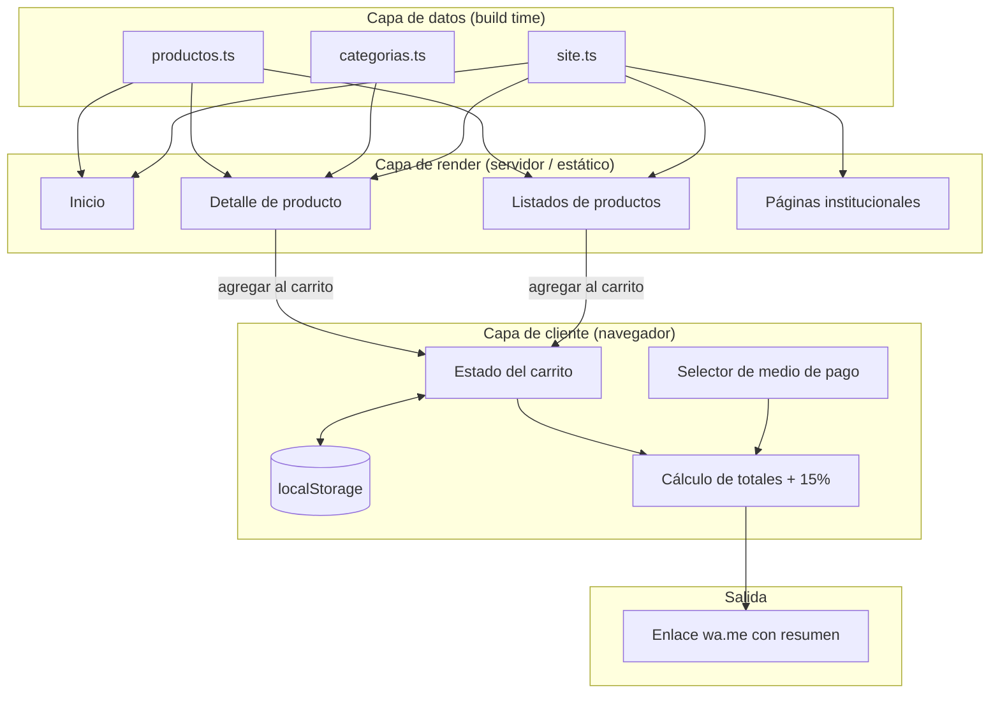
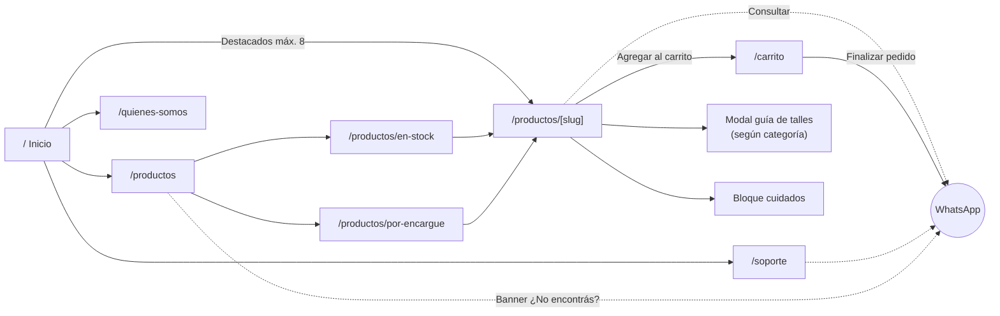
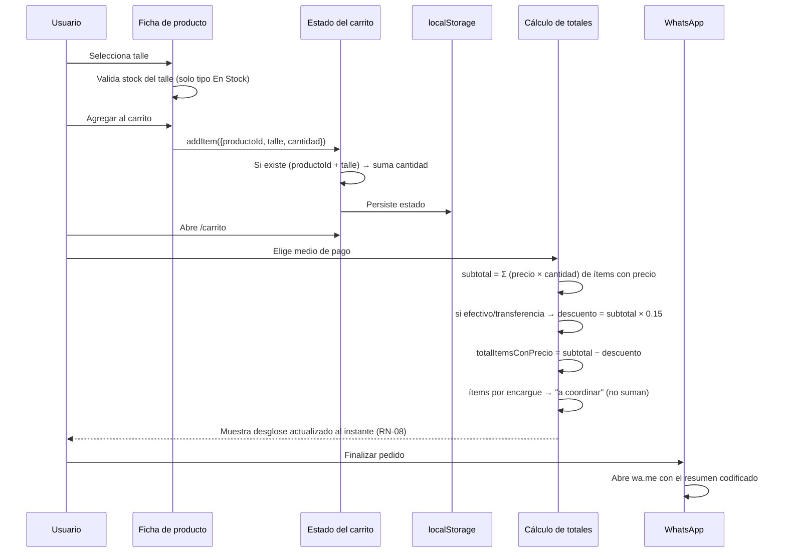

# Plan de Desarrollo — Gol de Vestuario

> **Documento de planificación.** No contiene implementación. Su objetivo es servir de hoja de ruta completa y accionable para construir el sitio web desde cero.
>
> - **Fecha de elaboración:** 27 de julio de 2026
> - **Estado del repositorio al momento del análisis:** sin código (solo documentación y assets gráficos)
> - **Fuentes analizadas:** `RN Gol de Vestuario.pdf`, `docs/design.md`, `docs/design.html`, `Logo Principal.png`, `Guia Talles Fan.png`, `Guia Talles Player.jpeg`, `Guia Talles Retro.jpeg`, `Cuidados de la camiseta.png`, `No encontras tu camiseta.png`

> **Nota de actualización (28 de julio de 2026):** las Fases 0 a 5 de este plan ya están implementadas. Además, a pedido explícito, se adelantó la Fase 6 (gestión de catálogo): el sitio pasó de "estático sin backend" (§3.1/S-03 de este documento) a tener una base de datos (SQLite vía Prisma) y un panel `/admin` con login para cargar productos sin tocar código. El resto de este documento describe el plan **original**; el estado real y las instrucciones de uso del admin están en [README.md](./README.md).

---

## Índice

1. [Resumen del proyecto](#1-resumen-del-proyecto)
2. [Estado actual](#2-estado-actual)
3. [Arquitectura propuesta](#3-arquitectura-propuesta)
4. [Tecnologías](#4-tecnologías)
5. [Estructura de páginas](#5-estructura-de-páginas)
6. [Componentes reutilizables](#6-componentes-reutilizables)
7. [Plan de implementación](#7-plan-de-implementación)
8. [Prioridades](#8-prioridades)
9. [Posibles problemas](#9-posibles-problemas)
10. [Mejoras recomendadas](#10-mejoras-recomendadas)
11. [Supuestos asumidos](#11-supuestos-asumidos)
12. [Información pendiente / dudas abiertas](#12-información-pendiente--dudas-abiertas)
13. [Checklist final](#13-checklist-final)

---

## 1. Resumen del proyecto

### 1.1 Objetivo principal

Construir el sitio web de **Gol de Vestuario**, un catálogo online de camisetas de fútbol de una marca argentina. El sitio funciona como **vidriera digital con carrito**, pero **no procesa pagos online**: el carrito genera un mensaje de WhatsApp con el resumen del pedido, y la venta se cierra por ese canal.

> Fuente: `RN Gol de Vestuario.pdf` — *"El manejo de carrito emitirá un mensaje a WhatsApp con el resumen del pedido"*.

Esto define el proyecto como un **catálogo estático con checkout asistido por WhatsApp**, no como un e-commerce transaccional. Es la decisión más determinante de toda la arquitectura: no se necesita pasarela de pago, gestión de órdenes, ni cuentas de usuario.

### 1.2 Público objetivo

No hay un documento de personas/usuarios en el proyecto. El público se infiere de la identidad de marca documentada en `docs/design.md` y de las piezas gráficas:

- Hinchas y consumidores de cultura futbolística argentina.
- Compradores de camisetas de club/selección en versiones **Fan**, **Player** y **Retro**.
- Rango de talles disponible: **M a 3XL** (Fan y Player) y **M a 2XL** (Retro), con alturas de referencia de 165 a 205 cm → público mayoritariamente adulto masculino.
- Uso predominante **mobile** (canal de cierre = WhatsApp; piezas gráficas en formato vertical tipo historia/feed de redes).

> El tono de marca está explícitamente definido: *"el vestuario como lugar sagrado: preparación, ritual, hermandad"*, con estética oscura, disciplinada, un único acento dorado (`docs/design.md`).

### 1.3 Problema que resuelve

| Problema | Cómo lo resuelve el sitio |
|---|---|
| El catálogo hoy vive disperso en redes / conversaciones de WhatsApp | Catálogo público, navegable y ordenado por disponibilidad y categoría |
| El cliente pregunta talle, precio y disponibilidad uno por uno | Ficha de producto con talle, precio, guía de talles y cuidados visibles |
| Los pedidos llegan desordenados al vendedor | El carrito arma un mensaje estructurado y estandarizado |
| El descuento por efectivo/transferencia se explica manualmente | Selector de medio de pago que calcula y muestra el 15% OFF en el momento |
| Hay stock no publicado que el cliente no descubre | Bloque recurrente *"¿No encontrás la camiseta que buscás?"* con CTA a WhatsApp |

### 1.4 Reglas de negocio (extraídas textualmente y normalizadas)

Origen: `RN Gol de Vestuario.pdf`.

| # | Regla | Impacto técnico |
|---|---|---|
| RN-01 | El sitio tiene 4 secciones: **Inicio**, **Productos**, **Quiénes somos**, **Soporte** | Define el árbol de rutas y la navegación principal |
| RN-02 | Inicio contiene: **Hero**, **productos destacados (máximo 8)** y **acceso a todos los productos** | Límite duro de 8 ítems destacados, validado en datos y en UI |
| RN-03 | Productos se divide en **2 secciones grandes: En Stock y Por Encargue** | Campo `tipo` en el modelo de producto; dos vistas/rutas separadas |
| RN-04 | Cada camiseta **En Stock** tiene su respectivo **talle y valor** | Precio numérico obligatorio + inventario por talle |
| RN-05 | Cada camiseta **Por Encargue** pide **qué talle se quiere** y **siempre aclara que el precio es a coordinar** | Sin precio numérico; leyenda obligatoria y no ocultable en ficha, carrito y mensaje de WhatsApp |
| RN-06 | Cada camiseta pertenece a una **categoría**; según la categoría, en su ficha se muestra la **foto de cuidados** y la **guía de talles** correspondiente | Mapa `categoría → {guiaTalles, cuidados}`; assets ya existentes |
| RN-07 | El carrito **emite un mensaje a WhatsApp con el resumen del pedido** | Generación de texto + enlace `wa.me`; sin backend de órdenes |
| RN-08 | **Efectivo o transferencia = 15% OFF.** Debe existir una opción de medio de pago que haga el cálculo y **lo muestre en el momento** | Selector de medio de pago con recálculo reactivo del total |

### 1.5 Categorías identificadas

Las categorías no están enumeradas en el PDF, pero se deducen sin ambigüedad de los assets: existen exactamente **tres guías de talles**, una por versión.

| Categoría | Asset de guía de talles | Talles | Medidas declaradas |
|---|---|---|---|
| **Fan** | `Guia Talles Fan.png` | M, L, XL, 2XL, 3XL | Largo (cm), Ancho (cm), Alto (cm) |
| **Player** | `Guia Talles Player.jpeg` | M, L, XL, 2XL, 3XL | Pecho (cm), Largo (cm), Altura (cm) |
| **Retro** | `Guia Talles Retro.jpeg` | M, L, XL, 2XL | Largo (cm), Ancho (cm), Alto (cm) |

Datos extraídos de las piezas (útiles si más adelante se decide renderizar las tablas en HTML en vez de usar la imagen — ver [Mejora M-07](#10-mejoras-recomendadas)):

**Versión Fan**

| Talle | Largo (cm) | Ancho (cm) | Alto (cm) |
|---|---|---|---|
| M | 70 | 48 | 175–180 |
| L | 72 | 50 | 180–185 |
| XL | 74 | 52 | 185–190 |
| 2XL | 76 | 54 | 190–195 |
| 3XL | 78 | 56 | 195–205 |

**Versión Player**

| Talle | Pecho (cm) | Largo (cm) | Altura (cm) |
|---|---|---|---|
| M | 50 | 70 | 165–175 |
| L | 52 | 72 | 170–180 |
| XL | 54 | 74 | 175–185 |
| 2XL | 56 | 76 | 180–190 |
| 3XL | 58 | 78 | 185–195 |

**Versión Retro**

| Talle | Largo (cm) | Ancho (cm) | Alto (cm) |
|---|---|---|---|
| M | 73 | 52 | 175–180 |
| L | 75 | 54 | 180–185 |
| XL | 77 | 56 | 185–190 |
| 2XL | 79 | 58 | 195–205 |

### 1.6 Contenido de cuidados

`Cuidados de la camiseta.png` define 4 reglas:

1. Lavar la prenda a mano en agua fría — **no usar lavarropas** (si se usa, opción de lavado delicado).
2. No secar la prenda al sol.
3. Utilizar jabón blanco.
4. No planchar la prenda.

⚠️ **Existe una sola pieza de cuidados**, pero RN-06 dice que la foto de cuidados depende de la categoría. Ver [P-06](#12-información-pendiente--dudas-abiertas).

---

## 2. Estado actual

### 2.1 Qué existe actualmente

| Archivo | Tipo | Contenido | Utilidad |
|---|---|---|---|
| `RN Gol de Vestuario.pdf` | Especificación funcional | Secciones del sitio + 5 reglas de negocio | **Única fuente funcional del proyecto** |
| `docs/design.md` | Sistema de diseño (formato design.md) | Tokens YAML (colores, tipografía, radios, espaciado, componentes) + guía en prosa con Do's/Don'ts | **Fuente de verdad visual**, lista para consumir |
| `docs/design.html` | Guía de estilo renderizada | Espejo humano de `design.md` con variables CSS y demos de componentes | Referencia visual; los nombres de variables CSS son reutilizables tal cual |
| `Logo Principal.png` | Asset | Escudo circular negro/dorado, 940 KB, cuadrado | Logo de navbar, favicon, OG image |
| `Guia Talles Fan.png` | Asset | Tabla de talles versión Fan, 1.78 MB | Modal de guía de talles (categoría Fan) |
| `Guia Talles Player.jpeg` | Asset | Tabla de talles versión Player, 123 KB | Modal de guía de talles (categoría Player) |
| `Guia Talles Retro.jpeg` | Asset | Tabla de talles versión Retro, 110 KB | Modal de guía de talles (categoría Retro) |
| `Cuidados de la camiseta.png` | Asset | 4 instrucciones de lavado, 1.76 MB | Bloque de cuidados en ficha de producto |
| `No encontras tu camiseta.png` | Asset | CTA a WhatsApp por catálogo ampliado, 1.66 MB | Banner CTA reutilizable |

**Total: 9 archivos. Cero líneas de código.**

### 2.2 Qué falta desarrollar

Prácticamente el 100% del producto. Enumerado por bloque:

- **Infraestructura**: repositorio Git, proyecto base, gestor de paquetes, linter, formateo, CI, hosting, dominio.
- **Sistema de diseño en código**: traducir los tokens de `docs/design.md` a configuración de estilos; cargar las 3 tipografías (Anton, Oswald, Bebas Neue).
- **Modelo de datos**: definición del producto, categorías, talles, stock, destacados; y el catálogo real cargado (hoy no existe **ni un solo producto** documentado).
- **Páginas**: Inicio, Productos (En Stock / Por Encargue), Detalle de producto, Quiénes somos, Soporte, Carrito, 404.
- **Carrito**: estado global, persistencia, agregado por talle, cantidades, eliminación.
- **Medio de pago y descuento**: selector con recálculo del 15% en vivo.
- **Integración WhatsApp**: plantilla de mensaje, codificación, enlace, número de destino.
- **Contenido editorial**: textos de Hero, Quiénes somos, Soporte/FAQ, descripciones de producto — **ninguno existe hoy**.
- **Fotos de producto**: no hay ninguna imagen de camiseta real en el repositorio.
- **Optimización de assets**: los PNG actuales pesan hasta 1.78 MB; hay que derivar versiones web.
- **SEO, accesibilidad, responsive, performance, analítica, QA.**

### 2.3 Riesgos detectados en el estado actual

| ID | Riesgo | Severidad | Detalle |
|---|---|---|---|
| R-01 | **No hay catálogo de productos** | 🔴 Alta | Sin productos reales no hay sitio. Es el bloqueante #1 y depende del negocio, no del desarrollo. |
| R-02 | **No hay fotos de producto** | 🔴 Alta | El diseño se apoya en tarjetas visuales; sin fotos no se puede validar layout ni performance real. |
| R-03 | **No hay número de WhatsApp documentado** | 🔴 Alta | Bloquea la funcionalidad central (RN-07). Debe parametrizarse por variable de entorno desde el día 1. |
| R-04 | **No hay textos institucionales** | 🟡 Media | Quiénes somos y Soporte quedan vacíos. Se puede avanzar con estructura y placeholders marcados. |
| R-05 | **Una sola pieza de cuidados para tres categorías** | 🟡 Media | Contradice parcialmente RN-06. Ver [P-06](#12-información-pendiente--dudas-abiertas). |
| R-06 | **Assets pesados y con nombres no aptos para web** | 🟡 Media | Espacios y acentos en nombres de archivo; 1.7 MB por imagen. Impacta performance y URLs. |
| R-07 | **Sin backend, el stock puede desactualizarse** | 🟡 Media | El cliente puede pedir un talle ya vendido. Mitigable con proceso de actualización y disclaimer. |
| R-08 | **Inconsistencia entre guías de talles** | 🟢 Baja | Fan/Retro miden "Largo/Ancho/Alto"; Player mide "Pecho/Largo/Altura". Además Retro salta de 185–190 (XL) a 195–205 (2XL), dejando un hueco. |
| R-09 | **Riesgo legal/comercial sobre marcas de terceros** | 🟡 Media | La venta de camisetas de clubes involucra marcas registradas. Conviene que el negocio defina qué se publica y cómo se describe (p. ej. evitar afirmar oficialidad si no la hay). **No documentado — decisión del negocio, no del desarrollo.** |
| R-10 | **`colors.primary` es idéntico a `colors.bg`** en `design.md` (`#0A0A0A`) | 🟢 Baja | Puede ser intencional (marca casi monocroma), pero conviene confirmarlo antes de usar `primary` como color de superficie. |

---

## 3. Arquitectura propuesta

### 3.1 Principio rector

> **Sitio estático con estado de carrito en el cliente. Sin backend propio.**

Justificación directa desde la documentación: la única acción "transaccional" descrita (RN-07) es *emitir un mensaje a WhatsApp*. No hay ninguna regla que exija persistir órdenes, autenticar usuarios ni cobrar. Introducir base de datos o API sería sobre-ingeniería no justificada por la documentación disponible.

Consecuencias:

- Todo el catálogo se resuelve en tiempo de build → páginas pre-renderizadas, muy rápidas y baratas de hostear.
- El carrito vive en el navegador (estado en memoria + persistencia local).
- El "checkout" es la construcción de una URL de WhatsApp.
- La actualización de catálogo es un cambio de datos + redeploy (automatizable). Ver [Fase 6](#fase-6--gestión-de-catálogo-opcional-post-lanzamiento) para la evolución a CMS.

### 3.2 Organización del proyecto

```
gol-de-vestuario/
├── docs/
│   ├── design.md                 # (existente) fuente de verdad visual
│   ├── design.html               # (existente) guía renderizada
│   └── contenido.md              # NUEVO: textos institucionales aprobados
├── public/
│   ├── brand/
│   │   ├── logo.png              # derivado de "Logo Principal.png"
│   │   ├── logo.webp
│   │   └── og-default.jpg
│   ├── guias/
│   │   ├── talles-fan.webp
│   │   ├── talles-player.webp
│   │   ├── talles-retro.webp
│   │   └── cuidados.webp
│   ├── banners/
│   │   └── no-encontras-tu-camiseta.webp
│   └── productos/
│       └── <slug-producto>/1.webp, 2.webp, ...
├── src/
│   ├── app/                      # rutas (ver §5)
│   ├── components/
│   │   ├── ui/                   # primitivas del design system
│   │   ├── layout/               # navbar, footer, contenedores
│   │   ├── producto/             # tarjeta, galería, selector de talle...
│   │   ├── carrito/              # ítems, resumen, medio de pago
│   │   └── contenido/            # hero, banners, acordeón, guías
│   ├── data/
│   │   ├── productos.ts          # catálogo (fuente única de productos)
│   │   ├── categorias.ts         # mapa categoría → guía + cuidados
│   │   └── site.ts               # nav, redes, textos cortos, constantes
│   ├── lib/
│   │   ├── carrito/              # estado, reducer, persistencia
│   │   ├── whatsapp.ts           # armado del mensaje y del enlace
│   │   ├── precios.ts            # descuento 15%, formato ARS
│   │   └── seo.ts                # metadatos por página
│   ├── hooks/
│   ├── styles/
│   │   └── tokens.css            # variables derivadas de design.md
│   └── types/
│       └── index.ts              # tipos de dominio
├── .env.example                  # NEXT_PUBLIC_WHATSAPP_NUMBER, etc.
└── README.md
```

**Decisión clave:** los assets originales del repositorio **no se modifican ni se mueven**; se generan copias optimizadas dentro de `public/` con nombres en kebab-case sin acentos.

### 3.3 Componentes principales de la arquitectura



### 3.4 Flujo de navegación



### 3.5 Flujo de datos del carrito y el descuento



### 3.6 Modelo de datos

**Entidad: Producto**

| Campo | Tipo | Obligatorio | Notas |
|---|---|---|---|
| `id` | texto | Sí | Identificador estable e inmutable |
| `slug` | texto | Sí | URL amigable, único (`boca-titular-2024-fan`) |
| `nombre` | texto | Sí | Nombre comercial mostrado |
| `club` | texto | No | Club o selección — habilita filtros ([M-01](#10-mejoras-recomendadas)) |
| `temporada` | texto | No | Ej.: `2024/25`, `1986` |
| `tipo` | `en-stock` \| `por-encargue` | Sí | **RN-03**. Determina precio, selector de talle y leyendas |
| `categoria` | `fan` \| `player` \| `retro` | Sí | **RN-06**. Determina guía de talles y cuidados |
| `precio` | número (ARS) | Solo si `tipo = en-stock` | **RN-04**. En `por-encargue` debe ser nulo/ausente |
| `talles` | lista de `{ talle, disponible }` | Sí | En `en-stock` refleja disponibilidad real; en `por-encargue`, los talles ofrecibles |
| `imagenes` | lista de rutas | Sí | Al menos 1; la primera es la portada |
| `descripcion` | texto | No | Detalle libre (material, detalles, origen) |
| `destacado` | booleano | Sí | **RN-02**. Máximo 8 en `true` — validar |
| `orden` | número | No | Orden manual dentro del listado |
| `activo` | booleano | Sí | Permite ocultar sin borrar |

**Entidad: Categoría (configuración, no editable por producto)**

| Campo | Descripción |
|---|---|
| `id` | `fan` \| `player` \| `retro` |
| `nombre` | Etiqueta visible (`Versión Fan`) |
| `guiaTalles` | Ruta a la imagen de guía correspondiente |
| `cuidados` | Ruta a la imagen de cuidados correspondiente (hoy la misma para las tres — ver [P-06](#12-información-pendiente--dudas-abiertas)) |
| `tallesDisponibles` | `["M","L","XL","2XL","3XL"]` / `["M","L","XL","2XL"]` en Retro |

**Entidad: Ítem de carrito (solo cliente)**

| Campo | Descripción |
|---|---|
| `productoId` | Referencia al producto |
| `talle` | Talle elegido — **obligatorio también en Por Encargue (RN-05)** |
| `cantidad` | Entero ≥ 1 |

La clave de unicidad del ítem es `productoId + talle`: el mismo producto en dos talles son dos líneas distintas.

**Entidad: Medio de pago**

| Valor | Descuento | Etiqueta sugerida |
|---|---|---|
| `efectivo` | 15% | Efectivo — 15% OFF |
| `transferencia` | 15% | Transferencia — 15% OFF |
| `otro` | 0% | Otro medio de pago |

> ⚠️ El PDF nombra explícitamente efectivo y transferencia como beneficiados. **No enumera qué otros medios se aceptan** — ver [P-04](#12-información-pendiente--dudas-abiertas). La opción `otro` es un placeholder deliberado y debe confirmarse.

### 3.7 Plantilla del mensaje de WhatsApp (RN-07)

Contenido propuesto del texto que se envía (no es código; es especificación de contenido):

```
Hola Gol de Vestuario! Quiero hacer este pedido:

EN STOCK
• Camiseta Boca Titular 2024 (Fan) — Talle L × 1 — $45.000
• Camiseta River Suplente 2024 (Player) — Talle XL × 2 — $110.000

POR ENCARGUE (precio a coordinar)
• Camiseta Argentina 1986 (Retro) — Talle M × 1

Medio de pago: Transferencia
Subtotal en stock: $155.000
Descuento 15%: -$23.250
Total en stock: $131.750
(Los productos por encargue se cotizan aparte)
```

Reglas de armado:

1. Separar siempre los ítems **En Stock** de los **Por Encargue**.
2. Incluir **siempre** la leyenda "precio a coordinar" en el bloque de encargue (RN-05).
3. Mostrar el medio de pago elegido y el desglose de descuento (RN-08).
4. Codificar el texto para URL y respetar un límite prudente de longitud (ver [R-13](#9-posibles-problemas)).

---

## 4. Tecnologías

### 4.1 Stack recomendado

> **Nota de transparencia:** la documentación del proyecto **no especifica ninguna tecnología**. Todo lo siguiente es una recomendación fundamentada en los requisitos, no un requisito documentado. Ver [S-01](#11-supuestos-asumidos).

| Capa | Elección | Justificación desde la documentación |
|---|---|---|
| **Framework** | **Next.js (App Router) + React + TypeScript** | El catálogo es contenido público que necesita indexarse (una tienda debe encontrarse en Google) y las fichas de producto se benefician de pre-render y metadatos por página. A la vez, el carrito y el selector de medio de pago (RN-08) exigen interactividad en cliente. Next.js cubre ambos sin backend propio. TypeScript aporta seguridad sobre el modelo de producto, que tiene reglas condicionales delicadas (precio obligatorio solo si `en-stock`). |
| **Estilos** | **Tailwind CSS** con tokens de `docs/design.md` mapeados a la configuración del tema | `design.md` ya entrega una escala cerrada de colores, tipografías, radios y espaciados. Una capa utilitaria configurada con exactamente esos tokens hace que salirse del sistema requiera esfuerzo deliberado, que es justamente lo que piden los "Don'ts" del documento (no agregar segundo color, no usar radios >12px, no usar sombras). |
| **Estado del carrito** | **React Context + reducer**, o **Zustand** si crece | El estado es pequeño (lista de ítems + medio de pago). No amerita una librería pesada. Zustand solo si aparece un drawer global con lógica compleja. |
| **Persistencia** | `localStorage` | Evita que el usuario pierda el carrito al navegar entre fichas. No hay requisito de cuentas ni de sincronizar entre dispositivos. |
| **Tipografías** | Anton, Oswald (400/500/700), Bebas Neue vía carga optimizada de fuentes de Next | `design.md` las nombra explícitamente. La carga optimizada evita el salto de fuente (CLS), crítico en un sitio donde el titular es display grande. |
| **Imágenes** | Componente de imagen de Next + conversión a WebP/AVIF | Los assets actuales pesan hasta 1.78 MB; sin optimización el sitio sería inusable en mobile con datos móviles (R-06). |
| **Iconos** | `lucide-react` (o SVG inline propio) | Set neutro, con trazo fino, coherente con la estética de líneas del sistema. |
| **Hosting** | **Vercel** (plan gratuito suficiente para empezar) | Deploy directo desde Git, build estático, dominio propio, HTTPS. Alternativa equivalente: Netlify o Cloudflare Pages. |
| **Control de versiones** | Git + GitHub | Hoy **el proyecto no es un repositorio Git** — es la primera tarea de la Fase 0. |
| **Calidad** | ESLint + Prettier + `typescript --noEmit` en CI | Barato de instalar al inicio, caro de retrofitear después. |

### 4.2 Alternativa considerada y descartada

| Alternativa | Por qué se descarta |
|---|---|
| **Vite + React (SPA pura)** | Más simple de arrancar, pero renderiza en cliente: peor SEO e Open Graph por producto. En un catálogo cuyo objetivo es ser encontrado y compartido por WhatsApp/redes (donde la previsualización del enlace importa mucho), es una desventaja concreta. Válida solo si el negocio decide que todo el tráfico vendrá de redes y no de búsqueda. |
| **Plataforma tipo Tiendanube / Shopify** | Resuelve catálogo y pagos out-of-the-box, pero el modelo de negocio documentado **no usa pago online** y sí exige una regla propia (precio a coordinar por encargue + descuento reactivo por medio de pago) que en esas plataformas se implementa peleando contra el sistema. Además impide aplicar el sistema de diseño propio con fidelidad. |
| **WordPress + WooCommerce** | Sobredimensionado: mantenimiento, plugins, seguridad y hosting con costo recurrente para un catálogo que puede ser estático. |
| **Backend + base de datos** | No hay ningún requisito documentado que lo justifique. Se puede incorporar después sin reescribir el front (ver Fase 6). |

### 4.3 Dependencias y variables de entorno

| Variable | Obligatoria | Descripción |
|---|---|---|
| `NEXT_PUBLIC_WHATSAPP_NUMBER` | ✅ Sí | Número en formato internacional sin `+` ni espacios (ej. `549XXXXXXXXXX`). **Bloqueante — no documentado (R-03).** |
| `NEXT_PUBLIC_SITE_URL` | ✅ Sí | Base para URLs canónicas y Open Graph |
| `NEXT_PUBLIC_INSTAGRAM_URL` | ⬜ Opcional | Enlace de redes en footer — no documentado |
| `NEXT_PUBLIC_ANALYTICS_ID` | ⬜ Opcional | Solo si se decide medir (ver [M-09](#10-mejoras-recomendadas)) |

---

## 5. Estructura de páginas

Rutas en español, coherentes con el idioma del producto y mejores para SEO local.

### 5.1 Mapa de rutas

| Ruta | Página | Render | Prioridad |
|---|---|---|---|
| `/` | Inicio | Estático | 🔴 Alta |
| `/productos` | Productos (hub con ambas secciones) | Estático | 🔴 Alta |
| `/productos/en-stock` | Listado En Stock | Estático | 🔴 Alta |
| `/productos/por-encargue` | Listado Por Encargue | Estático | 🔴 Alta |
| `/productos/[slug]` | Detalle de producto | Estático (una por producto) | 🔴 Alta |
| `/carrito` | Carrito y checkout por WhatsApp | Cliente | 🔴 Alta |
| `/quienes-somos` | Quiénes somos | Estático | 🟡 Media |
| `/soporte` | Soporte | Estático | 🟡 Media |
| `/404` | No encontrado | Estático | 🟡 Media |

---

### 5.2 `/` — Inicio

**Objetivo (RN-02):** presentar la marca, mostrar hasta 8 productos destacados y dar acceso claro a todo el catálogo.

**Secciones, en orden:**

1. **Hero** — eyebrow + titular display (Anton, mayúsculas) + bajada + CTA primario "Ver productos" y CTA secundario. El sistema de diseño ya prescribe exactamente esta composición (`docs/design.html`, bloque `hero`).
2. **Fila de valores (3 columnas)** — `stat-card` con Bebas Neue. `design.html` propone *Calidad / Comunidad / Estilo*. Texto pendiente de aprobación.
3. **Productos destacados** — grilla de **máximo 8** `ProductCard`. Si hay menos de 8, la grilla se adapta; si hay más marcados, se recorta y se advierte en build.
4. **Accesos a las dos secciones grandes** — dos bloques hacia En Stock y Por Encargue (RN-03).
5. **Banner "¿No encontrás la camiseta que buscás?"** — asset existente, CTA a WhatsApp.
6. **Footer.**

**Componentes:** `Navbar`, `Hero`, `StatRow`, `SectionHeader`, `ProductGrid`, `ProductCard`, `CTABanner`, `Footer`.

**Funcionalidades:** filtrado de destacados; validación del límite de 8; enlaces a listados y a fichas.

**Dependencias:** catálogo con al menos 8 productos marcados como destacados; textos de Hero; fotos de portada.

---

### 5.3 `/productos` — Hub de productos

**Objetivo (RN-03):** presentar las **dos secciones grandes** del catálogo.

**Decisión de diseño:** el PDF dice "2 secciones grandes". Se interpreta como **una página que contiene ambas secciones**, con anclas y, además, rutas dedicadas para poder enlazar y compartir cada una por separado. Esto satisface la lectura literal (ambas visibles en Productos) sin perder enlaces profundos.

**Secciones:**
1. Encabezado de sección + explicación breve de la diferencia entre En Stock y Por Encargue.
2. Bloque **En Stock**: grilla + enlace "Ver todas".
3. Bloque **Por Encargue**: grilla + **aviso destacado y permanente: "Precio a coordinar"** (RN-05).
4. Banner "¿No encontrás la camiseta que buscás?".

**Componentes:** `SectionHeader`, `ProductGrid`, `ProductCard`, `Notice`, `CTABanner`.

---

### 5.4 `/productos/en-stock` y `/productos/por-encargue`

**Objetivo:** listado completo de cada sección.

**Diferencias entre ambas:**

| Aspecto | En Stock | Por Encargue |
|---|---|---|
| Precio en tarjeta | Precio en ARS (RN-04) | Leyenda "Precio a coordinar" (RN-05) |
| Talles | Los disponibles, con agotados marcados | Todos los de la categoría |
| CTA | Agregar al carrito / Ver | Consultar / Ver |
| Aviso de sección | — | Aviso fijo de precio a coordinar |

**Funcionalidades:** grilla responsive, orden por `orden`, estado vacío explícito, y (recomendado) filtros por categoría y talle — ver [M-01](#10-mejoras-recomendadas).

---

### 5.5 `/productos/[slug]` — Detalle de producto

**Objetivo (RN-04, RN-05, RN-06):** es **la página más importante del sitio**; concentra tres de las cinco reglas de negocio.

**Estructura:**

1. Migas de pan: Inicio › Productos › En Stock/Por Encargue › Producto.
2. **Galería de imágenes** (portada + miniaturas).
3. **Bloque de compra**:
   - Nombre, club/temporada, `CategoryBadge` (Fan / Player / Retro).
   - **Precio** (En Stock) o **"Precio a coordinar"** destacado (Por Encargue).
   - **Selector de talle** — obligatorio en ambos tipos. En Stock deshabilita los agotados; Por Encargue ofrece los talles de la categoría.
   - Selector de cantidad.
   - Botón "Agregar al carrito" — **deshabilitado hasta elegir talle**.
   - Enlace "Consultar por WhatsApp" con el producto pre-cargado en el mensaje.
   - Enlace "Ver guía de talles" → abre el modal con la imagen de la categoría.
4. **Descripción**.
5. **Bloque de cuidados** — imagen/contenido de cuidados de la categoría (RN-06).
6. **Guía de talles** — visible en la página además del modal.
7. **Productos relacionados** (misma categoría o mismo tipo).
8. Banner "¿No encontrás la camiseta que buscás?".

**Componentes:** `Breadcrumbs`, `ProductGallery`, `PriceDisplay`, `SizeSelector`, `QuantityStepper`, `AddToCartButton`, `CategoryBadge`, `SizeGuideModal`, `CareGuide`, `ProductGrid`, `CTABanner`.

**Reglas críticas de esta página:**

- Nunca mostrar precio numérico si `tipo = por-encargue`.
- Nunca permitir agregar al carrito sin talle (aplica también a Por Encargue, por RN-05).
- La guía de talles y los cuidados **se resuelven por `categoria`**, jamás se hardcodean por producto.

---

### 5.6 `/carrito` — Carrito y checkout por WhatsApp

**Objetivo (RN-07, RN-08):** revisar el pedido, elegir medio de pago, ver el descuento calculado en vivo y enviar el resumen por WhatsApp.

**Estructura:**

1. Lista de ítems agrupados por tipo (En Stock / Por Encargue), cada uno con miniatura, nombre, categoría, talle, cantidad editable, subtotal o "a coordinar" y botón eliminar.
2. **Selector de medio de pago** (RN-08): efectivo, transferencia, otro.
3. **Resumen** con desglose: subtotal en stock → descuento 15% (si aplica) → total en stock → nota sobre ítems por encargue.
4. **Botón "Finalizar pedido por WhatsApp"**.
5. Estado vacío con CTA a `/productos`.

**Regla de cálculo (carrito mixto):** los ítems Por Encargue **no participan del subtotal ni del descuento**, porque no tienen precio (RN-05). El total mostrado se rotula explícitamente como *total de productos en stock*, y se aclara que lo encargado se cotiza aparte. Ver [P-03](#12-información-pendiente--dudas-abiertas).

**Componentes:** `CartItemRow`, `QuantityStepper`, `PaymentMethodSelector`, `OrderSummary`, `WhatsAppCheckoutButton`, `EmptyState`.

---

### 5.7 `/quienes-somos`

**Objetivo (RN-01):** contar la marca y generar confianza.

**Estructura propuesta** (contenido pendiente — R-04): eyebrow + titular, relato de marca, fila de valores (`stat-card`), imagen/logo, CTA a productos.

El sistema de diseño ya da la materia prima narrativa: *"el vestuario — donde se gana realmente el partido: preparación, ritual, hermandad"* (`docs/design.md`). **No se debe inventar historia, fechas ni datos de la empresa**: se deja estructura con marcadores de contenido explícitos.

---

### 5.8 `/soporte`

**Objetivo (RN-01):** resolver dudas y ofrecer canal de contacto.

**Estructura propuesta:**

1. **Preguntas frecuentes (acordeón)** — con las respuestas que **sí** están documentadas:
   - ¿Cómo compro? → armás el carrito y se envía el pedido por WhatsApp (RN-07).
   - ¿Qué medios de pago hay y hay descuento? → efectivo y transferencia tienen 15% OFF (RN-08).
   - ¿Qué significa "Por Encargue"? → elegís talle y el precio se coordina (RN-05).
   - ¿Cómo sé qué talle soy? → guías por versión Fan/Player/Retro (RN-06).
   - ¿Cómo cuido la camiseta? → las 4 reglas de `Cuidados de la camiseta.png`.
   - ¿No encontrás tu camiseta? → catálogo ampliado por WhatsApp.
2. **Guías de talles completas**, una por categoría.
3. **Cuidados de la prenda**.
4. **Contacto directo por WhatsApp**.
5. ⚠️ **Envíos, plazos, cambios y devoluciones: no documentados.** Se dejan como secciones marcadas pendientes, sin inventar políticas ([P-05](#12-información-pendiente--dudas-abiertas)).

**Componentes:** `FAQAccordion`, `SizeGuideTabs`, `CareGuide`, `ContactCard`.

---

### 5.9 `/404`

Página de error con la estética de marca, mensaje breve y accesos a Inicio y Productos.

---

### 5.10 Dependencias por página

| Página | Depende de (técnico) | Depende de (contenido / negocio) |
|---|---|---|
| `/` | Primitivas UI, `ProductCard`, `ProductGrid`, `CTABanner`, catálogo con destacados | Textos de Hero y valores (P-08), fotos de portada (P-09) |
| `/productos` | Catálogo, `ProductGrid`, `Notice` | Catálogo cargado (P-02) |
| `/productos/en-stock` | Catálogo filtrado por `tipo`, `PriceDisplay`, `StockBadge` | Precios y stock por talle (P-02) |
| `/productos/por-encargue` | Catálogo filtrado por `tipo`, `Notice` permanente | Lista de productos encargables y talles ofrecibles (P-02) |
| `/productos/[slug]` | Catálogo, `categorias.ts`, `ProductGallery`, `SizeSelector`, `SizeGuideModal`, `CareGuide`, `CartProvider` | Fotos por producto (P-09), descripciones, piezas de cuidados por categoría (P-06) |
| `/carrito` | `CartProvider`, `lib/precios`, `lib/whatsapp`, `PaymentMethodSelector` | Número de WhatsApp (P-01), decisión sobre el 15% en encargue (P-03), medios de pago aceptados (P-04) |
| `/quienes-somos` | `SectionHeader`, `StatRow`, `Card` | Historia y valores de la marca (P-07) |
| `/soporte` | `FAQAccordion`, `SizeGuideTabs`, `CareGuide`, `ContactCard` | Políticas de envío, cambios y devoluciones (P-05); número de WhatsApp (P-01) |
| `/404` | Primitivas UI, `EmptyState` | — |

---

## 6. Componentes reutilizables

### 6.1 Primitivas de UI (derivadas 1:1 de `docs/design.md`)

| Componente | Variantes / estados | Origen en el sistema de diseño |
|---|---|---|
| `Button` | `primary`, `primary:hover`, `secondary`, `secondary:hover`, `disabled`; tamaños sm/md | `button-primary`, `button-secondary`, `button-disabled` |
| `Badge` | `default`, `accent`, `success`, `error`, `muted` | `badge` (pill, borde, sin relleno) |
| `Input` | normal, foco, error, deshabilitado | `input` (fondo `surface-alt`) |
| `Card` | `surface` con radio `lg` | `card` |
| `Container` | ancho máximo + padding lateral | Layout §"Layout" |
| `Section` | padding vertical + separador hairline | `section.dsec` en `design.html` |
| `SectionHeader` | eyebrow (Oswald, dorado, ls 3px) + título Anton | Estilo `eyebrow` |
| `Divider` | hairline `border` | "Elevation & Depth": sin sombras, solo bordes |
| `Modal` | overlay + panel; cierre por Esc/click fuera; foco atrapado | Debe subir contraste de superficie, **nunca usar sombra** |
| `Accordion` | ítem abierto/cerrado, accesible por teclado | Necesario para FAQ |
| `Tabs` | activo/inactivo | Guías de talles y hub de productos |
| `Skeleton` | bloques de carga | Percepción de performance |
| `EmptyState` | icono + mensaje + CTA | Carrito y listados vacíos |
| `Toast` | éxito / error | Confirmación de "agregado al carrito" |

> ⚠️ Reglas no negociables tomadas de los "Don'ts": un solo color de marca (dorado) y siempre escaso; sin sombras ni glassmorphism; Anton/Bebas Neue solo en display y **siempre en mayúsculas**; radios ≤ 12px; los botones secundarios **nunca** usan dorado; el fondo nunca se aclara a gris medio.

### 6.2 Layout

| Componente | Descripción |
|---|---|
| `Navbar` | Logo + navegación (Inicio, Productos, Quiénes somos, Soporte) + indicador de carrito con contador. Fondo `bg`, solo borde inferior hairline. |
| `MobileMenu` | Menú desplegable a pantalla completa para mobile. |
| `CartIndicator` | Contador de ítems; enlace a `/carrito`. |
| `Footer` | Logo, navegación secundaria, redes, contacto por WhatsApp, aviso legal. |
| `WhatsAppFloatButton` | Botón flotante persistente. **El canal de venta es WhatsApp**, así que debe estar siempre a un toque. |

### 6.3 Producto

| Componente | Responsabilidad |
|---|---|
| `ProductCard` | Portada, nombre, `CategoryBadge`, precio o "a coordinar", CTA. **Se adapta a `tipo`.** |
| `ProductGrid` | Grilla responsive (1 col mobile / 2 tablet / 3–4 desktop). |
| `ProductGallery` | Imagen principal + miniaturas + zoom opcional. |
| `PriceDisplay` | Formato ARS, precio tachado/descuento cuando corresponda, o leyenda "a coordinar". Centraliza RN-04 y RN-05. |
| `SizeSelector` | Botones de talle, agotados deshabilitados, obligatorio. |
| `StockBadge` | "Últimas unidades" / "Sin stock" / "Por encargue". |
| `CategoryBadge` | Fan / Player / Retro. |
| `AddToCartButton` | Deshabilitado sin talle; dispara `Toast`. |
| `ProductFilters` | Filtros por categoría, talle y club (ver [M-01](#10-mejoras-recomendadas)). |
| `RelatedProducts` | Reutiliza `ProductGrid`. |

### 6.4 Carrito

| Componente | Responsabilidad |
|---|---|
| `CartProvider` | Estado global + persistencia + acciones (agregar, quitar, cambiar cantidad, vaciar). |
| `CartItemRow` | Línea de ítem con controles. |
| `QuantityStepper` | Incremento/decremento con mínimo 1. |
| `PaymentMethodSelector` | **RN-08.** Cambia el total en el momento. |
| `OrderSummary` | Desglose: subtotal, descuento, total, nota de encargue. |
| `WhatsAppCheckoutButton` | Arma y abre el enlace `wa.me`. |
| `CartDrawer` | (Opcional) panel lateral para revisar sin salir de la página. |

### 6.5 Contenido

| Componente | Responsabilidad |
|---|---|
| `Hero` | Bloque principal de Inicio. |
| `StatRow` / `StatCard` | Fila de 3 valores en Bebas Neue. |
| `CTABanner` | Bloque "¿No encontrás la camiseta que buscás?" reutilizable en Inicio, listados y ficha. |
| `SizeGuideModal` | Guía de talles según categoría. |
| `SizeGuideTabs` | Las tres guías juntas para `/soporte`. |
| `CareGuide` | Cuidados de la prenda. |
| `FAQAccordion` | Preguntas frecuentes. |
| `ContactCard` | Canales de contacto. |
| `Breadcrumbs` | Navegación jerárquica. |

---

## 7. Plan de implementación

Seis fases. Cada una entrega algo verificable. Las estimaciones asumen **un desarrollador**, y **excluyen** la producción de contenido y fotografía, que corre por cuenta del negocio.

### Fase 0 — Fundaciones

**Objetivo:** proyecto ejecutable con el sistema de diseño ya cargado.

| # | Tarea | Prioridad |
|---|---|---|
| 0.1 | Inicializar repositorio Git y primer commit (**hoy el proyecto no está versionado**) | 🔴 Alta |
| 0.2 | Crear proyecto Next.js + TypeScript | 🔴 Alta |
| 0.3 | Configurar Tailwind con los tokens exactos de `docs/design.md` (colores, tipografía, radios, espaciado) | 🔴 Alta |
| 0.4 | Cargar Anton, Oswald (400/500/700) y Bebas Neue de forma optimizada | 🔴 Alta |
| 0.5 | Definir estilos base: fondo `#0A0A0A`, texto `#F2EFE6`, selección, foco visible en dorado | 🔴 Alta |
| 0.6 | Copiar y optimizar assets a `public/` con nombres kebab-case sin acentos (WebP + fallback) | 🔴 Alta |
| 0.7 | Generar favicon y OG por defecto desde el logo | 🟡 Media |
| 0.8 | ESLint + Prettier + verificación de tipos | 🟡 Media |
| 0.9 | `.env.example` con `NEXT_PUBLIC_WHATSAPP_NUMBER` y `NEXT_PUBLIC_SITE_URL` | 🔴 Alta |
| 0.10 | Layout raíz: `Navbar` + `Footer` + `Container` | 🔴 Alta |
| 0.11 | Deploy inicial a Vercel (aunque esté vacío) para tener entorno desde el día 1 | 🟡 Media |

**Criterio de salida:** el sitio levanta, aplica la identidad visual y está desplegado.

---

### Fase 1 — Sistema de diseño en componentes

**Objetivo:** biblioteca de primitivas fiel a `docs/design.html`.

| # | Tarea | Prioridad |
|---|---|---|
| 1.1 | `Button` con las 5 variantes/estados | 🔴 Alta |
| 1.2 | `Badge`, `Input`, `Card`, `Divider` | 🔴 Alta |
| 1.3 | `Container`, `Section`, `SectionHeader` (eyebrow + Anton) | 🔴 Alta |
| 1.4 | `Modal` accesible (Esc, click fuera, foco atrapado, sin sombras) | 🔴 Alta |
| 1.5 | `Accordion` y `Tabs` accesibles | 🟡 Media |
| 1.6 | `Toast`, `EmptyState`, `Skeleton` | 🟡 Media |
| 1.7 | Página interna de revisión visual de componentes (no indexable) | 🟢 Baja |

**Criterio de salida:** las primitivas se ven idénticas a las demos de `docs/design.html`.

---

### Fase 2 — Catálogo

**Objetivo:** productos navegables de punta a punta.

| # | Tarea | Prioridad |
|---|---|---|
| 2.1 | Definir tipos de dominio (Producto, Categoría, Talle, Tipo) | 🔴 Alta |
| 2.2 | Crear `categorias.ts` con el mapa categoría → guía de talles + cuidados + talles válidos (RN-06) | 🔴 Alta |
| 2.3 | Crear `productos.ts` y cargar el catálogo real (**depende del negocio — R-01**) | 🔴 Alta |
| 2.4 | Validación en build: máximo 8 destacados (RN-02); precio obligatorio solo en `en-stock` (RN-04); precio ausente en `por-encargue` (RN-05); talles válidos según categoría | 🔴 Alta |
| 2.5 | `ProductCard` + `ProductGrid` + `PriceDisplay` + `CategoryBadge` + `StockBadge` | 🔴 Alta |
| 2.6 | Página `/productos` (hub con las dos secciones — RN-03) | 🔴 Alta |
| 2.7 | Páginas `/productos/en-stock` y `/productos/por-encargue` | 🔴 Alta |
| 2.8 | Página `/productos/[slug]` con generación estática por producto | 🔴 Alta |
| 2.9 | `ProductGallery`, `SizeSelector`, `QuantityStepper` | 🔴 Alta |
| 2.10 | `SizeGuideModal` y `CareGuide` resueltos por categoría (RN-06) | 🔴 Alta |
| 2.11 | `Breadcrumbs` y `RelatedProducts` | 🟡 Media |
| 2.12 | Estados vacíos y página 404 | 🟡 Media |

**Criterio de salida:** se puede llegar a cualquier ficha, ver precio o "a coordinar", elegir talle y consultar la guía correcta según la categoría.

---

### Fase 3 — Carrito, medio de pago y WhatsApp

**Objetivo:** cerrar el circuito de venta. **Es el corazón funcional del proyecto (RN-07 + RN-08).**

| # | Tarea | Prioridad |
|---|---|---|
| 3.1 | `CartProvider`: agregar, quitar, cambiar cantidad, vaciar; clave `productoId + talle` | 🔴 Alta |
| 3.2 | Persistencia en `localStorage` con hidratación segura y migración ante catálogo cambiado | 🔴 Alta |
| 3.3 | `AddToCartButton` bloqueado sin talle (aplica también a Por Encargue — RN-05) | 🔴 Alta |
| 3.4 | `CartIndicator` en la navbar | 🔴 Alta |
| 3.5 | Página `/carrito` con ítems agrupados por tipo | 🔴 Alta |
| 3.6 | `PaymentMethodSelector` con recálculo inmediato (RN-08) | 🔴 Alta |
| 3.7 | Lógica de precios: subtotal, 15% OFF, total, formato ARS, exclusión de ítems por encargue | 🔴 Alta |
| 3.8 | `OrderSummary` con desglose visible del descuento | 🔴 Alta |
| 3.9 | Generación del mensaje de WhatsApp según la plantilla de §3.7 (RN-07) | 🔴 Alta |
| 3.10 | Construcción y apertura del enlace `wa.me` + control de longitud del mensaje | 🔴 Alta |
| 3.11 | "Consultar por WhatsApp" desde la ficha, con producto y talle pre-cargados | 🟡 Media |
| 3.12 | `WhatsAppFloatButton` global | 🟡 Media |
| 3.13 | `CartDrawer` (opcional) | 🟢 Baja |

**Criterio de salida:** con un carrito mixto (stock + encargue) y medio de pago "transferencia", el mensaje de WhatsApp llega correcto, con descuento aplicado solo a lo que corresponde.

---

### Fase 4 — Contenido e institucionales

**Objetivo:** completar las secciones restantes de RN-01.

| # | Tarea | Prioridad |
|---|---|---|
| 4.1 | Página `/` completa: Hero, `StatRow`, destacados (máx. 8), accesos a secciones, banner CTA | 🔴 Alta |
| 4.2 | `CTABanner` "¿No encontrás la camiseta que buscás?" reutilizable | 🔴 Alta |
| 4.3 | Página `/quienes-somos` con estructura y marcadores de contenido | 🟡 Media |
| 4.4 | Página `/soporte`: FAQ + guías de talles + cuidados + contacto | 🟡 Media |
| 4.5 | `docs/contenido.md` con todos los textos aprobados centralizados | 🟡 Media |
| 4.6 | Redacción final e incorporación de textos reales (**depende del negocio — R-04**) | 🟡 Media |

**Criterio de salida:** no queda ninguna sección de RN-01 sin página.

---

### Fase 5 — Calidad, SEO y lanzamiento

| # | Tarea | Prioridad |
|---|---|---|
| 5.1 | Responsive verificado en 360 / 390 / 768 / 1024 / 1440 px | 🔴 Alta |
| 5.2 | Accesibilidad: foco visible, navegación por teclado, `alt` en todas las imágenes, roles ARIA en modal/acordeón/tabs, contraste AA | 🔴 Alta |
| 5.3 | Metadatos por página: título, descripción, canónica, Open Graph, Twitter Card | 🔴 Alta |
| 5.4 | OG específica por producto (clave: los enlaces se comparten por WhatsApp) | 🟡 Media |
| 5.5 | `sitemap.xml` y `robots.txt` | 🟡 Media |
| 5.6 | Datos estructurados `Product` (solo con precio cuando existe) | 🟢 Baja |
| 5.7 | Performance: imágenes optimizadas, lazy loading, Lighthouse ≥ 90 en mobile | 🔴 Alta |
| 5.8 | Pruebas manuales de todos los flujos (checklist §13) | 🔴 Alta |
| 5.9 | Dominio propio + HTTPS | 🔴 Alta |
| 5.10 | Analítica básica, si el negocio la quiere | 🟢 Baja |
| 5.11 | `README.md` con instrucciones de cómo agregar/editar un producto | 🟡 Media |

---

### Fase 6 — Gestión de catálogo (opcional, post-lanzamiento)

**Objetivo:** que el dueño pueda actualizar el catálogo sin tocar código. **No está documentado como requisito**, pero es la evolución natural: en un catálogo de indumentaria el stock cambia seguido y R-07 se vuelve crítico con el tiempo.

| # | Tarea | Prioridad |
|---|---|---|
| 6.1 | Evaluar opciones: CMS headless (Sanity/Contentful), Google Sheets como fuente, o panel propio con base de datos | 🟢 Baja |
| 6.2 | Migrar `productos.ts` a la fuente elegida manteniendo el mismo modelo de datos | 🟢 Baja |
| 6.3 | Redeploy automático al publicar cambios | 🟢 Baja |
| 6.4 | Carga y optimización de imágenes desde el panel | 🟢 Baja |

> El modelo de datos de §3.6 está pensado para que esta migración **no obligue a reescribir el front**: cambia la fuente, no la forma.

---

## 8. Prioridades

### 🔴 Alta — sin esto no hay producto lanzable

| Tarea | Regla / Riesgo |
|---|---|
| Setup del proyecto y sistema de diseño en código | Base de todo |
| Modelo de datos y catálogo cargado | RN-03/04/05, R-01 |
| Listados En Stock y Por Encargue | RN-03 |
| Ficha de producto con precio o "a coordinar" | RN-04, RN-05 |
| Selector de talle obligatorio en ambos tipos | RN-04, RN-05 |
| Guía de talles y cuidados por categoría | RN-06 |
| Carrito funcional con persistencia | RN-07 |
| Selector de medio de pago con 15% calculado en vivo | RN-08 |
| Generación del mensaje y enlace de WhatsApp | RN-07 |
| Inicio con Hero + máximo 8 destacados + acceso al catálogo | RN-02 |
| Responsive mobile-first | Canal predominante |
| Optimización de imágenes | R-06 |
| Número de WhatsApp configurado | R-03 |
| Deploy con dominio y HTTPS | Lanzamiento |

### 🟡 Media — necesario para un lanzamiento profesional

Quiénes somos · Soporte con FAQ · Banner CTA reutilizable · Consultar producto por WhatsApp · Botón flotante de WhatsApp · Breadcrumbs · Productos relacionados · Estados vacíos y 404 · SEO y Open Graph por producto · Sitemap y robots · Accesibilidad completa · Toast de confirmación · README de mantenimiento · Filtros de catálogo.

### 🟢 Baja — mejoras posteriores

Buscador por texto · Carrito lateral (drawer) · Datos estructurados · Analítica · Compartir producto · Wishlist · Guías de talles renderizadas en HTML · Página interna de componentes · CMS / panel de administración · Animaciones y microinteracciones.

---

## 9. Posibles problemas

| ID | Problema | Prob. | Impacto | Mitigación |
|---|---|---|---|---|
| R-11 | **Falta el número de WhatsApp** (R-03) | Alta | 🔴 Crítico | Parametrizar por variable de entorno desde la Fase 0; el desarrollo avanza con un número de prueba y se reemplaza antes del lanzamiento. |
| R-12 | **Falta el catálogo real** (R-01) | Alta | 🔴 Crítico | Trabajar con datos de ejemplo claramente marcados; entregar al negocio una plantilla con los campos exactos de §3.6 para que cargue el catálogo en paralelo. |
| R-13 | **El mensaje de WhatsApp se corta** con carritos grandes: las URLs `wa.me` tienen límites prácticos de longitud (varios navegadores empiezan a fallar cerca de los ~2.000 caracteres) | Media | 🔴 Alto | Compactar el formato del texto; ante muchos ítems, resumir (agrupar por producto, omitir descripciones) y avisar al usuario; probar con carritos de 15–20 ítems antes de lanzar. |
| R-14 | **Carrito mixto y descuento ambiguo** (RN-05 vs RN-08): no está documentado si el 15% se aplica también a lo encargado | Alta | 🟡 Medio | Decisión asumida: **no se aplica** porque no hay precio. Se rotula el total como "productos en stock" y se aclara que el encargue se cotiza aparte. **Confirmar con el negocio ([P-03](#12-información-pendiente--dudas-abiertas)).** |
| R-15 | **Stock desactualizado** (R-07): el cliente reserva un talle ya vendido | Alta | 🟡 Medio | Leyenda "sujeto a disponibilidad, se confirma por WhatsApp"; proceso simple y documentado para actualizar; a futuro, Fase 6. |
| R-16 | **Imágenes pesadas**: 1.78 MB por pieza mata la performance en 3G/4G | Alta | 🟡 Medio | Conversión a WebP/AVIF, tamaños responsivos, lazy loading, presupuesto de peso por página. |
| R-17 | **Nombres de archivo con espacios y acentos** (R-06) | Alta | 🟢 Bajo | Renombrar las copias en `public/` a kebab-case ASCII. No tocar los originales. |
| R-18 | **Carrito persistido apunta a productos que ya no existen** tras un redeploy con catálogo cambiado | Media | 🟡 Medio | Al hidratar, descartar ítems cuyo `productoId` no exista y avisar al usuario. |
| R-19 | **Precio en ARS con inflación**: los valores quedan viejos rápido | Alta | 🟡 Medio | Facilitar la edición masiva de precios; mostrar fecha de actualización; a futuro, Fase 6. |
| R-20 | **La guía de talles como imagen no es accesible ni legible en mobile** | Alta | 🟡 Medio | Zoom en el modal + versión en tabla HTML ([M-07](#10-mejoras-recomendadas)); `alt` descriptivo. |
| R-21 | **Una sola pieza de cuidados para tres categorías** (R-05) | Alta | 🟢 Bajo | Modelar el campo por categoría igualmente; hoy las tres apuntan al mismo archivo. Si el negocio provee piezas específicas, solo cambia el dato. |
| R-22 | **Tipografías display en mayúsculas y con acentos**: Anton y Bebas Neue en mayúsculas exigen verificar que rendericen bien Á, É, Í, Ó, Ú, Ñ | Media | 🟢 Bajo | Probar cadenas reales ("VERSIÓN", "DISEÑO") antes de fijar la tipografía. |
| R-23 | **Contraste insuficiente** con `text-muted` (#8A8A8A) sobre `bg` en textos chicos | Media | 🟡 Medio | Reservar `text-muted` para textos no esenciales; verificar AA en cada uso. |
| R-24 | **Riesgo legal por marcas de terceros** (R-09) | Media | 🟡 Medio | Que el negocio defina la política de descripción de productos. **Fuera del alcance técnico.** |
| R-25 | **Sin analítica no se sabe qué funciona** | Alta | 🟢 Bajo | Instrumentar al menos los clics de "Finalizar pedido por WhatsApp" si el negocio acepta ([M-09](#10-mejoras-recomendadas)). |
| R-26 | **Bloqueo por contenido faltante**: sin textos ni fotos, las Fases 4 y 5 se frenan | Alta | 🟡 Medio | Arrancar la recolección de contenido en paralelo a la Fase 0, no cuando la fase lo necesite. |

---

## 10. Mejoras recomendadas

Solo se incluyen mejoras **justificadas por algo presente en la documentación**. No se proponen funcionalidades sin anclaje.

| ID | Mejora | Justificación documental | Prioridad |
|---|---|---|---|
| **M-01** | **Filtros por categoría, talle y club** en los listados | `No encontras tu camiseta.png` dice *"Contamos con un catálogo mucho más amplio"* → si el catálogo es grande, una grilla plana no escala | 🟡 Media |
| **M-02** | **Banner CTA "¿No encontrás la camiseta que buscás?" reutilizable** en Inicio, listados, ficha y estados vacíos | Existe una pieza gráfica dedicada exclusivamente a este mensaje → el negocio lo considera prioritario | 🔴 Alta |
| **M-03** | **Persistencia del carrito** en el navegador | RN-07 implica que el usuario navegará varias fichas antes de enviar el pedido; perder el carrito rompería el flujo | 🔴 Alta |
| **M-04** | **Guía de talles accesible desde la ficha, en modal** | RN-06 exige mostrarla en la ficha; en modal evita empujar el bloque de compra fuera de pantalla en mobile | 🔴 Alta |
| **M-05** | **Marcar talles agotados en lugar de ocultarlos** | RN-04 asocia talle y valor a los productos en stock; mostrar el agotado comunica el rango real y evita frustración | 🟡 Media |
| **M-06** | **Botón "Consultar por WhatsApp" en cada ficha** | RN-05 obliga a coordinar precio en Por Encargue → conviene un atajo directo sin pasar por el carrito | 🟡 Media |
| **M-07** | **Guías de talles también como tabla HTML** (además de la imagen) | Los datos ya están extraídos (§1.5). Mejora accesibilidad, SEO y legibilidad en mobile, donde una imagen vertical de tabla es difícil de leer | 🟡 Media |
| **M-08** | **Open Graph por producto** | El canal de venta es WhatsApp: cada enlace compartido debe previsualizar con foto, nombre y precio | 🟡 Media |
| **M-09** | **Medir clics de "Finalizar pedido"** | RN-07 hace que la conversión sea invisible (ocurre fuera del sitio); sin este evento no hay forma de saber si el sitio vende | 🟢 Baja |
| **M-10** | **Mostrar el precio con descuento ya calculado también en la ficha** | RN-08 pide mostrar el cálculo "en el momento"; anticiparlo en la ficha refuerza el incentivo antes del carrito | 🟢 Baja |
| **M-11** | **Bloque de cuidados en `/soporte` además de la ficha** | La pieza de cuidados es contenido de posventa; en Soporte se consulta cuando ya se compró | 🟢 Baja |
| **M-12** | **Botón flotante de WhatsApp** | Todo el modelo de negocio termina en WhatsApp; debe estar a un toque en cualquier página | 🟡 Media |
| **M-13** | **Aviso "sujeto a disponibilidad"** en productos En Stock | Mitiga R-07/R-15, inevitable en una arquitectura sin backend | 🟡 Media |
| **M-14** | **Corregir el fallback de Bebas Neue** en la guía de estilo (`design.html` usa `cursive`; lo correcto es `sans-serif`) | Si la fuente no carga, el texto caería a una tipografía cursiva, contradiciendo la identidad definida en `design.md` | 🟢 Baja |

---

## 11. Supuestos asumidos

Decisiones tomadas para poder avanzar, **explicitadas para que puedan ser revertidas**.

| ID | Supuesto | Fundamento | Reversible |
|---|---|---|---|
| **S-01** | El stack será Next.js + TypeScript + Tailwind sobre Vercel | La documentación no especifica tecnología; se elige por SEO, pre-render, costo y ajuste al modelo sin backend | Sí, antes de Fase 0 |
| **S-02** | Las categorías son exactamente **Fan, Player y Retro** | Existen exactamente tres guías de talles, una por versión | Sí, agregando datos |
| **S-03** | Sin backend, base de datos ni cuentas de usuario | Ninguna regla de negocio lo requiere | Sí, en Fase 6 |
| **S-04** | El sitio es **monolingüe en español (Argentina)** | Toda la documentación y las piezas están en español rioplatense ("encontrás", "escribime") | Sí, con costo alto |
| **S-05** | Los precios se muestran en **pesos argentinos (ARS)** | Marca argentina; el PDF no menciona moneda | Sí |
| **S-06** | El descuento del 15% **no aplica a productos Por Encargue** | No tienen precio (RN-05), por lo que no hay base de cálculo | Sí, decisión de negocio |
| **S-07** | El talle es **obligatorio también en Por Encargue** | RN-05: *"se pedirá qué talle se quiere"* | No |
| **S-08** | Los ítems del carrito se identifican por **producto + talle** | Consecuencia directa de RN-04 y RN-05 | No |
| **S-09** | El límite de 8 destacados es **un máximo, no un mínimo** | RN-02: *"8 como máximo"* | No |
| **S-10** | `/productos` muestra ambas secciones **y además** existen rutas dedicadas | Satisface la lectura literal de RN-03 sin perder enlaces compartibles | Sí |
| **S-11** | Los assets originales **no se modifican ni se renombran**; se generan copias optimizadas en `public/` | Instrucción explícita de no modificar archivos existentes | No |
| **S-12** | El sitio **no procesa pagos** | RN-07 y RN-08: el pago se acuerda por WhatsApp | No |
| **S-13** | Se ofrece un medio de pago genérico "otro" sin descuento | RN-08 solo nombra efectivo y transferencia como beneficiados; se asume que existen otros medios sin descuento | Sí, ver [P-04](#12-información-pendiente--dudas-abiertas) |

---

## 12. Información pendiente / dudas abiertas

**Ningún ítem de esta lista fue inventado ni completado por suposición en el plan.** Todos requieren respuesta del negocio.

| ID | Pendiente | Bloquea | Impacto si no se resuelve |
|---|---|---|---|
| **P-01** | 🔴 **Número de WhatsApp de destino** | Fase 3 (lanzamiento) | La funcionalidad central no opera |
| **P-02** | 🔴 **Catálogo de productos**: lista completa con nombre, club, temporada, categoría, tipo, precio, talles y fotos | Fase 2 | No hay contenido; se avanza con datos de ejemplo |
| **P-03** | 🔴 **¿El 15% aplica a productos Por Encargue?** Si el precio es "a coordinar", ¿se comunica el beneficio igual? | Fase 3 | Se implementa según [S-06](#11-supuestos-asumidos) y podría requerir cambio |
| **P-04** | 🟡 **¿Qué otros medios de pago se aceptan?** (tarjeta, débito, Mercado Pago...) RN-08 solo nombra los que tienen descuento | Fase 3 | El selector queda con una opción genérica "otro" |
| **P-05** | 🟡 **Políticas de envío, plazos, cambios y devoluciones** | Fase 4 | `/soporte` queda incompleta; el PDF no dice nada al respecto |
| **P-06** | 🟡 **¿Hay una pieza de cuidados por categoría?** RN-06 dice que la foto de cuidados depende de la categoría, pero solo existe una imagen | Fase 2 | Las tres categorías comparten la misma pieza |
| **P-07** | 🟡 **Textos de Quiénes somos**: historia, origen, valores, equipo | Fase 4 | Página con estructura pero sin contenido real |
| **P-08** | 🟡 **Textos del Hero y de la fila de valores** | Fase 4 | Se usan los placeholders de `design.html` |
| **P-09** | 🟡 **Fotografías de producto**: cantidad por producto, formato, fondo | Fase 2 | No se puede validar el diseño real de las tarjetas |
| **P-10** | 🟡 **Dominio definitivo** | Fase 5 | No se puede configurar hosting final ni URLs canónicas |
| **P-11** | 🟢 **Redes sociales** (Instagram, TikTok) para el footer | Fase 4 | Footer incompleto |
| **P-12** | 🟢 **¿Se venden talles S o infantiles?** Ninguna guía los incluye | Fase 2 | El modelo soporta agregarlos, pero no hay medidas |
| **P-13** | 🟢 **¿Hay productos que no sean camisetas?** (shorts, buzos, accesorios) La documentación solo habla de camisetas | Fase 2 | El modelo actual asume camisetas |
| **P-14** | 🟢 **Datos fiscales / razón social** para el pie de página | Fase 5 | Footer sin información legal |
| **P-15** | 🟢 **¿Se quiere analítica?** (Google Analytics, Meta Pixel) — implica aviso de cookies | Fase 5 | Sin medición de resultados |
| **P-16** | 🟢 **Inconsistencia en las guías de talles**: Fan/Retro usan "Largo/Ancho/Alto", Player usa "Pecho/Largo/Altura"; y en Retro hay un salto entre XL (185–190) y 2XL (195–205) | Fase 2 | Se usan las imágenes tal cual; bloquea [M-07](#10-mejoras-recomendadas) |
| **P-17** | 🟢 **¿`colors.primary` = `colors.bg` es intencional?** (R-10) | Fase 0 | Se asume que sí y no se usa `primary` como superficie diferenciada |

---

## 13. Checklist final

### Fase 0 — Fundaciones

- [ ] Inicializar repositorio Git y publicar en GitHub
- [ ] Crear proyecto Next.js con TypeScript
- [ ] Configurar Tailwind con los colores de `docs/design.md`
- [ ] Configurar la escala tipográfica (display, h1, h2, stat-label, eyebrow, body, body-small, caption, nav, button)
- [ ] Configurar radios (none, sm, md, lg, full) y espaciado (4→56px)
- [ ] Cargar Anton, Oswald 400/500/700 y Bebas Neue de forma optimizada
- [ ] Verificar que Anton y Bebas Neue rendericen acentos y Ñ en mayúsculas (R-22)
- [ ] Definir estilos globales (fondo, texto, selección, foco visible dorado)
- [ ] Copiar y optimizar assets a `public/` en WebP con nombres kebab-case ASCII
- [ ] Generar favicon e imagen Open Graph por defecto desde el logo
- [ ] Configurar ESLint, Prettier y verificación de tipos
- [ ] Crear `.env.example` con las variables de entorno
- [ ] Construir `Navbar`, `Footer` y layout raíz
- [ ] Deploy inicial en Vercel

### Fase 1 — Sistema de diseño

- [ ] `Button` (primary, primary-hover, secondary, secondary-hover, disabled)
- [ ] `Badge` con variantes
- [ ] `Input` con estados normal / foco / error / deshabilitado
- [ ] `Card` con superficie y radio `lg`
- [ ] `Container`, `Section`, `SectionHeader`, `Divider`
- [ ] `Modal` accesible (Esc, click fuera, foco atrapado, sin sombras)
- [ ] `Accordion` accesible
- [ ] `Tabs` accesible
- [ ] `Toast`, `EmptyState`, `Skeleton`
- [ ] Página interna de revisión de componentes
- [ ] Verificar fidelidad contra `docs/design.html`
- [ ] Auditar que no se hayan violado los "Don'ts" (segundo color, sombras, radios >12px, display en body, secundario dorado)

### Fase 2 — Catálogo

- [ ] Definir tipos de dominio (Producto, Categoría, Talle, TipoProducto, MedioDePago)
- [ ] Crear `categorias.ts` con el mapa categoría → guía de talles + cuidados + talles válidos
- [ ] Crear la estructura de `productos.ts`
- [ ] Cargar el catálogo real *(requiere P-02)*
- [ ] Validar en build: máximo 8 destacados
- [ ] Validar en build: precio obligatorio en En Stock y ausente en Por Encargue
- [ ] Validar en build: talles coherentes con la categoría
- [ ] Validar en build: slugs únicos y al menos una imagen por producto
- [ ] `ProductCard` adaptable a En Stock / Por Encargue
- [ ] `ProductGrid` responsive
- [ ] `PriceDisplay` con formato ARS y leyenda "a coordinar"
- [ ] `CategoryBadge` y `StockBadge`
- [ ] Página `/productos` con las dos secciones grandes
- [ ] Página `/productos/en-stock`
- [ ] Página `/productos/por-encargue` con aviso permanente de precio a coordinar
- [ ] Página `/productos/[slug]` generada estáticamente
- [ ] `ProductGallery` con miniaturas
- [ ] `SizeSelector` con agotados deshabilitados
- [ ] `QuantityStepper`
- [ ] `SizeGuideModal` resuelto por categoría
- [ ] `CareGuide` resuelto por categoría
- [ ] `Breadcrumbs`
- [ ] `RelatedProducts`
- [ ] Estados vacíos en todos los listados
- [ ] Página 404

### Fase 3 — Carrito, pago y WhatsApp

- [ ] `CartProvider` con agregar / quitar / actualizar cantidad / vaciar
- [ ] Clave de ítem por `productoId + talle`
- [ ] Persistencia en `localStorage` con hidratación segura
- [ ] Descartar ítems huérfanos tras cambios de catálogo (R-18)
- [ ] `AddToCartButton` deshabilitado hasta seleccionar talle
- [ ] Talle obligatorio también en Por Encargue
- [ ] `CartIndicator` con contador en la navbar
- [ ] Página `/carrito` con ítems agrupados por tipo
- [ ] `CartItemRow` con edición y eliminación
- [ ] `PaymentMethodSelector` (efectivo, transferencia, otro)
- [ ] Cálculo del subtotal excluyendo ítems por encargue
- [ ] Cálculo del 15% OFF para efectivo y transferencia
- [ ] Recálculo inmediato al cambiar el medio de pago (RN-08)
- [ ] `OrderSummary` con desglose visible del descuento
- [ ] Nota explícita de que lo encargado se cotiza aparte
- [ ] Generación del mensaje de WhatsApp según plantilla
- [ ] Separación de bloques En Stock / Por Encargue en el mensaje
- [ ] Leyenda "precio a coordinar" siempre presente en el bloque de encargue
- [ ] Codificación correcta del texto en la URL
- [ ] Control de longitud del mensaje y estrategia de resumen (R-13)
- [ ] Botón "Finalizar pedido por WhatsApp"
- [ ] "Consultar por WhatsApp" desde la ficha con producto y talle
- [ ] `WhatsAppFloatButton` global
- [ ] Estado vacío del carrito con CTA
- [ ] Prueba end-to-end con carrito mixto y cada medio de pago

### Fase 4 — Contenido e institucionales

- [ ] `Hero` de Inicio
- [ ] `StatRow` de 3 valores
- [ ] Grilla de destacados con máximo 8 *(RN-02)*
- [ ] Accesos a En Stock y Por Encargue desde Inicio
- [ ] `CTABanner` "¿No encontrás la camiseta que buscás?"
- [ ] Reutilizar el banner en listados, ficha y estados vacíos
- [ ] Página `/quienes-somos` estructurada
- [ ] Página `/soporte` con FAQ
- [ ] FAQ: cómo comprar, medios de pago y descuento, qué es Por Encargue, cómo elegir talle, cuidados, catálogo ampliado
- [ ] Guías de talles de las tres categorías en `/soporte`
- [ ] Bloque de cuidados en `/soporte`
- [ ] Tarjeta de contacto por WhatsApp
- [ ] Crear `docs/contenido.md` centralizando textos
- [ ] Incorporar textos definitivos *(requiere P-05, P-07, P-08)*
- [ ] Marcar visiblemente las secciones sin contenido aprobado

### Fase 5 — Calidad, SEO y lanzamiento

- [ ] Responsive verificado en 360 / 390 / 768 / 1024 / 1440 px
- [ ] Navegación por teclado completa
- [ ] Foco visible en todos los elementos interactivos
- [ ] `alt` descriptivo en todas las imágenes (incluidas guías y cuidados)
- [ ] Roles y atributos ARIA en modal, acordeón y tabs
- [ ] Contraste AA verificado, con atención a `text-muted` (R-23)
- [ ] Títulos y descripciones únicos por página
- [ ] URLs canónicas
- [ ] Open Graph y Twitter Card por página
- [ ] Open Graph específico por producto
- [ ] `sitemap.xml` y `robots.txt`
- [ ] Datos estructurados `Product` (solo con precio real)
- [ ] Todas las imágenes en formato moderno y con tamaños responsivos
- [ ] Lazy loading fuera del viewport inicial
- [ ] Lighthouse mobile ≥ 90 en Performance, Accesibilidad, SEO y Buenas prácticas
- [ ] Verificar que ningún producto Por Encargue muestre precio numérico
- [ ] Verificar el límite de 8 destacados en producción
- [ ] Verificar que cada categoría muestre su guía de talles correcta
- [ ] Probar el enlace de WhatsApp en Android, iOS y escritorio
- [ ] Reemplazar el número de WhatsApp de prueba por el definitivo *(requiere P-01)*
- [ ] Configurar dominio propio y HTTPS *(requiere P-10)*
- [ ] Analítica, si el negocio la aprueba *(requiere P-15)*
- [ ] `README.md` con guía de cómo agregar y editar productos
- [ ] Revisión final del cliente y aprobación

### Fase 6 — Gestión de catálogo (opcional)

- [ ] Evaluar CMS headless vs. Google Sheets vs. panel propio
- [ ] Migrar la fuente de datos manteniendo el modelo
- [ ] Redeploy automático al publicar
- [ ] Carga y optimización de imágenes desde el panel
- [ ] Capacitar al dueño en el uso del panel

### Cierre de pendientes de negocio

- [ ] P-01 Número de WhatsApp
- [ ] P-02 Catálogo completo de productos
- [ ] P-03 ¿El 15% aplica a Por Encargue?
- [ ] P-04 Otros medios de pago aceptados
- [ ] P-05 Políticas de envío, cambios y devoluciones
- [ ] P-06 ¿Pieza de cuidados por categoría?
- [ ] P-07 Textos de Quiénes somos
- [ ] P-08 Textos del Hero y valores
- [ ] P-09 Fotografías de producto
- [ ] P-10 Dominio definitivo
- [ ] P-11 Redes sociales
- [ ] P-12 ¿Talles S o infantiles?
- [ ] P-13 ¿Productos que no sean camisetas?
- [ ] P-14 Datos fiscales para el footer
- [ ] P-15 ¿Se quiere analítica?
- [ ] P-16 Inconsistencias entre guías de talles
- [ ] P-17 ¿`primary` = `bg` es intencional?

---

## Resumen ejecutivo

**Gol de Vestuario** es un catálogo de camisetas de fútbol con cierre de venta por WhatsApp. La documentación disponible define con claridad **qué** hay que construir (4 secciones, 8 reglas de negocio normalizadas, 3 categorías con sus guías, y un sistema de diseño completo y listo para consumir), pero **no** define la tecnología ni el contenido.

El proyecto se puede construir en **6 fases**, de las cuales las **Fases 0 a 3 constituyen el producto mínimo lanzable**: catálogo navegable + carrito + descuento reactivo + pedido por WhatsApp.

Los **tres bloqueantes reales no son técnicos**: falta el número de WhatsApp (P-01), falta el catálogo de productos con sus fotos (P-02, P-09) y falta definir si el descuento del 15% aplica a los productos por encargue (P-03). Conviene destrabarlos en paralelo a la Fase 0 para que no frenen las fases finales.

La mayor fortaleza del punto de partida es `docs/design.md`: un sistema de diseño cerrado, opinado y con reglas explícitas, que elimina la ambigüedad visual y permite ir directo a construir componentes desde el primer día.
